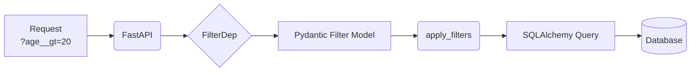

# fastapi-query-filters

Efficient and intuitive query filtering for FastAPI, with built-in support for SQLAlchemy and extensibility for other ORMs.

---

## ⚡ Quick Start (30s)

```python
from fastapi import FastAPI, Depends
from fastapi_query_filters import FilterDep
from pydantic import BaseModel, Field

class UserSchema(BaseModel):
    username: str = Field(json_schema_extra={"filters": ["eq", "icontains"]})

app = FastAPI()

@app.get("/users")
def list_users(filters = FilterDep(UserSchema)):
    return filters  # Now responds to ?username__eq=... and ?username__icontains=...
```

---

## How it works



---

## Why `fastapi-query-filters`?

- **Zero Boilerplate**: Define your Pydantic schema and let the library handle the REST.
- **Type Safe**: Full integration with FastAPI's dependency injection and Pydantic's validation.
- **ORM Agnostic Core**: Built to support multiple ORMs (SQLAlchemy supported out-of-the-box).
- **Modern Features**: Global search, dynamic sorting, and strict filtering mode.

## Installation

```bash
pip install fastapi-query-filters
```

## Features

- **Dynamic Filtering**: Support for `eq`, `ne`, `gt`, `lt`, `icontains`, `in`, and more.
- **Global Search**: Search across multiple columns with a single query parameter.
- **Flexible Sorting**: Dynamic sorting with prefix support (e.g., `-created_at`).
- **Strict Mode**: Raise 422 errors for unknown query parameters.
- **Nested Relationships**: Filter by related model fields with configurable depth.

---

[Get Started with Tutorials :material-arrow-right:](tutorials/basic-usage.md)
